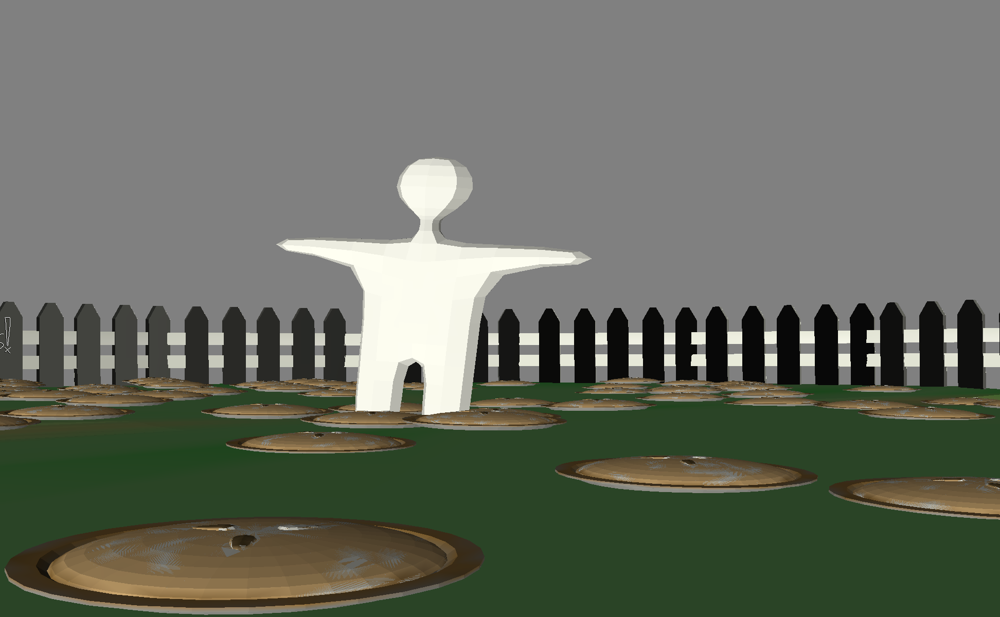

# Pie Fight

Author: George Whitfield

Design: Throw pies at your friends!

Networking: (TODO: How does your game implement client/server multiplayer? What messages are transmitted? Where in the code?)

Screen Shot:

How To Play:

(TODO: describe the controls and (if needed) goals/strategy.)

Sources: (TODO: list a source URL for any assets you did not create yourself. Make sure you have a license for the asset.)
Roboto Font: https://fonts.google.com/specimen/Roboto

This game was built with [NEST](NEST.md).

